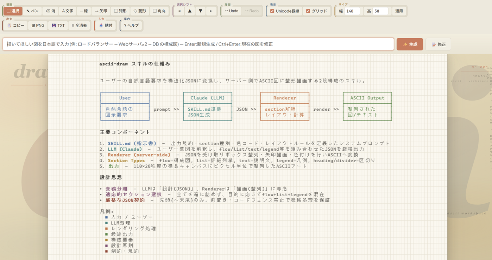

# ascii-draw

> ローカル Web エディタで **AI 生成 × 手調整 × PNG 書き出し** ができる、構成図/フロー図/シーケンス図/ER図/状態遷移図ジェネレータ。
> Claude Code CLI のサブスクリプション経由で動くので **API キー不要**、しかも **ファイルは一切書き換えません**。
> Windows / Claude Code Skill 形式。

<a href="screenshots/screen1.png">
  
</a>

## こんな人に

- PowerPoint や Notion / Markdown に **きれいな ASCII 構成図** を貼りたい
- ChatGPT に「図を描いて」と頼むとセルがズレてイライラする
- Mermaid や draw.io は仕様が重い・絵文字や罫線でサクッと描きたい
- ローカルで完結させたい（社内資料・機密情報を SaaS に流したくない）

## 主な機能

| 機能 | 説明 |
|------|------|
| **AI 生成** | 日本語で「OAuth 認可フロー」「マイクロサービス構成」など書いて Enter → Unicode 罫線で整列された図が出る |
| **範囲選択 → 部分修正** | `V` キーで直したい場所だけ選んで修正指示。**他の場所は触られない** |
| **手動編集** | クリック / ドラッグでセル単位の自由編集、シフト、選択挿入、Undo/Redo |
| **PNG エクスポート** | PowerPoint 貼り付け用に **3× 解像度** で書き出し |
| **アプリ内ヘルプ** | `F1` または右上「? ヘルプ」ですべての操作・ショートカットを表示 |
| **完全ローカル** | `127.0.0.1:8765` のみ。ネットには出ない |

## 動作要件

- **Windows**（PowerShell 5.1 以上、管理者権限・開発者モード**不要**）
- **Python**（[python.org](https://www.python.org/downloads/) 公式版を入れて `py -V` が通る状態）
- **Claude Code CLI**（[claude.ai/code](https://claude.ai/code) からインストール、`claude` コマンドが PATH に通っている状態）

## インストール

### 推奨: Claude Code に頼む

```
git clone https://github.com/sinjorjob/ascii-draw.git
```

そのあと Claude Code に：

> `ascii-draw\ascii-draw\scripts\install.ps1` を実行してスキルをセットアップして

Claude Code が `~/.claude/skills/ascii-draw/` に Copy-Item でインストールしてくれます。**admin / 開発者モード不要**、ロックダウンされた会社 PC でも動きます。

### 手動インストール

```powershell
powershell -NoProfile -ExecutionPolicy Bypass `
  -File ".\ascii-draw\scripts\install.ps1" -Force
```

または `clone` した中の `ascii-draw\` フォルダを丸ごと `%USERPROFILE%\.claude\skills\` にコピーするだけでも OK。

インストール後 **Claude Code を再起動** すれば `/ascii-draw` で呼べるようになります。

## 使い方

### 起動

Claude Code のチャット欄で：

```
/ascii-draw
```

→ 自動でブラウザが開き `http://127.0.0.1:8765` が表示されます。

### 図を生成

入力欄に日本語で何が描きたいか書いて Enter（または「✨ 生成」）。

| 入力例 |
|-------|
| `OAuth 2.0 認可コードフローのシーケンス図` |
| `Webアプリ → API → DB の3層アーキテクチャ` |
| `注文・配送・決済のマイクロサービス構成` |

完成した図は Canvas にレンダリングされます。

### 部分修正（このツールの目玉）

「DB の右の Redis のラベルだけ直したい」みたいなとき：

1. `V` キーを押す（または「選択」ツール）
2. 直したい部分だけドラッグ
3. 入力欄に修正指示を書く
4. **「📝 選択範囲のみ修正」** をクリック

→ 選んだ範囲だけが書き変わり、他の部分は **1 セルも動きません**。

LLM は本来 ASCII の整列が苦手ですが、このツールは「該当範囲だけ切り出して再生成 → 元の座標にはめ直す」設計なので、図全体が崩れることがありません。

### エクスポート

ヘッダ右側の **「PNG 出力」** で 3× 解像度の PNG を保存。PowerPoint へそのまま貼れる解像度です。

### 全ショートカット

アプリ内で `F1` キー、または右上 **「? ヘルプ」** ボタンを押すと、全機能のリファレンスが見られます。

## アーキテクチャ

```
ブラウザ (assets/index.html)
   │ HTTP
   ▼
scripts/server.py     ← Python http.server、127.0.0.1:8765 のみ受付
   │ subprocess
   ▼
claude -p             ← Claude Code CLI (Opus, --effort low)
                        --tools Read,Glob,Grep （読み取り 3 種のみ）
```

- **API キー不要**: 既存の Claude Code ログインを再利用
- **権限最小化**: 子プロセスの `claude` には Write / Edit / Bash 任意実行 / WebFetch / WebSearch / Task すべて**渡していない**
- **副作用なし**: 図の生成中にユーザーのファイルが書き換わることは仕組み上不可能

## フォルダ構成（[Anthropic Skill Best Practices](https://platform.claude.com/docs/en/agents-and-tools/agent-skills/best-practices) 準拠）

```
ascii-draw/                    ← repo（このリポジトリ）
├── README.md                  ← 今これ
├── LICENSE
├── screenshots/
│   └── screen1.png
└── ascii-draw/                ← skill 本体（~/.claude/skills/ にコピーする中身）
    ├── SKILL.md               ← root 直下は manifest のみ
    ├── scripts/               ← 実行ファイル
    │   ├── launch.ps1         ← /ascii-draw から呼ばれるランチャ
    │   ├── server.py          ← HTTP + Claude CLI ブリッジ
    │   ├── start.bat          ← 手動起動用
    │   ├── install.ps1        ← Claude Code にインストール
    │   └── uninstall.ps1
    ├── assets/                ← 静的アセット
    │   └── index.html         ← Canvas エディタ UI
    └── references/            ← 必要時に Claude が読む docs
        ├── prompt-cookbook.md
        └── troubleshooting.md
```

## アンインストール

```powershell
powershell -NoProfile -ExecutionPolicy Bypass `
  -File "%USERPROFILE%\.claude\skills\ascii-draw\scripts\uninstall.ps1" -Force
```

ポート 8765 で動いているサーバを停止してから skill フォルダを削除します。

## トラブルシューティング

[`ascii-draw/references/troubleshooting.md`](ascii-draw/references/troubleshooting.md) に症状別の対処をまとめてあります。

代表例：

- **`'py' command not found`** → `winget install Python.Python.3.12` で Python を入れる
- **タイムアウトを連発する** → `Get-Process claude | Stop-Process -Force` で claude.exe ゾンビを掃除
- **罫線がガタつく** → ヘッダの「Unicode罫線」チェックボックスをオン

## ライセンス

MIT License — 詳細は [LICENSE](LICENSE) を参照。
